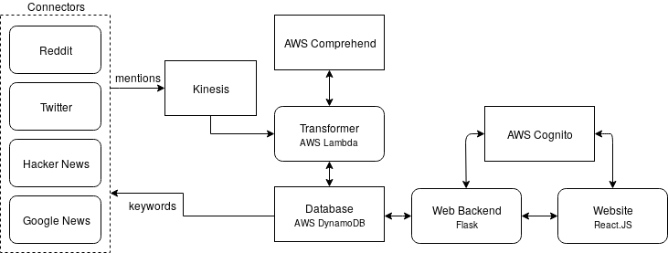
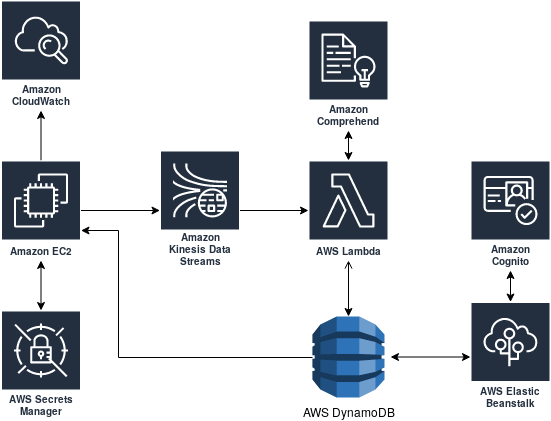

# Sentinel

The Sentinel project provides a dashboard presenting insights into the volume and quality of the conversation towards followed brand, products or services in a time-aware manner. The most important features include:

1. Tracking keywords appearances -- real-time monitoring of occurrences of selected keywords or their variations on the Internet. Keywords can include, but are not limited to: brand name, key products or events, most important staff members, company-owned domains. User can manage followed keywords using the website.
2. Evaluating sentiment expressed in the text -- numerical summary of emotions taking into account keywords and evaluated automatically.
3. Listing of mentions -- direct links and content of all of the mentions; to allow for quick response from the PR department.

## Architecture

Data streams consumed in this project come from multiple sources: Google News, Hacker News, Reddit and Twitter. Diagram presented below show the general flow of the data throughout the system:

Multiple services, based on the AWS platform, were used to ensure high scalability of the system.

## Acknowledgments

The project was developed for Big Data and Cloud Architecting classes at the Warsaw University of Technology by Marcin Dardziński, Paweł Rzepiński, Ryszard Szymański and Sebastian Sowik.
